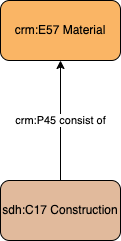

# Construction - Material light

## Questions to answer

- Do we need an extended description of materials, through the production event (+ modification)?

## Description

This profile describes the composition in materials of constructions, without any relationships with events of production or modification of the building.

## What can be described in this profile

- The materials that compose the construction, documented with a controlled vocabulary

## Diagram

## Examples

### Example 1

The parthenon is composed of Pentelic marble.

### Example 2

The Golden Gate bridge is composed of steel and concrete.
