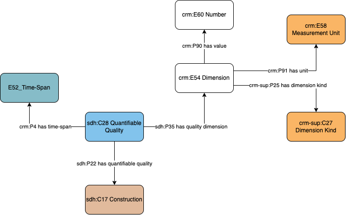

# Construction - Measurements

## Questions to answer

- Do we need to has a light version of this profile? (with `crm:P43 has dimension` -> `crm:E54 Dimension`)?

## Description

This profile describes the physical quality of constructions in terms of measures (size, length, weight, etc.). This quality is time bound, so evolution in measurements can be described. This profile does not describe the act of measurement.

## What can be described in this profile

- The measurement unit, documented with a controlled vocabulary
- The kind of dimension, documented with a Geovistory controlled vocabulary (weight, length, etc.)
- The measure itself, documented as a string
- The time-span of that quality.

## Diagram

## Examples

### Example 1

The Parthenon is 69.5m long and 30.9m wide.

### Example 2

Fictional: A bridge was 100m long from its construction in 1974 to its renovation in 2005 and extended, up to a length of 122m until its destruction in 2020.
