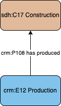

# Construction - Production

## Questions to answer

- How necessary is this profile? It allows to only have the production event and the participations related to it in the person/group profiles.

## Description

This profile links a production event with the construction that was built.

## What can be described in this profile

No information is documented in this profile. It only link the creation event with a specific construction.

## Diagram

## Examples

### Example 1

The production of the Parthenon.
