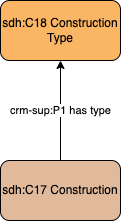

# Construction - Type

## Questions to answer

- A

## Description

This profile describes the type of construction, in the sense of a characterization and classification of a construction, without any temporal bounds or context.
The profile `Construction - Classification` describes in more details and within a speccific social context this classification.

## What can be described in this profile

- The type of construction, documented with a controlled vocabulary

## Diagram

## Examples

### Example 1

The cathedral Notre Dame in Paris has the type Catholic cathedral (<http://www.wikidata.org/entity/Q56242215>).

### Example 2

Do we need another example?
