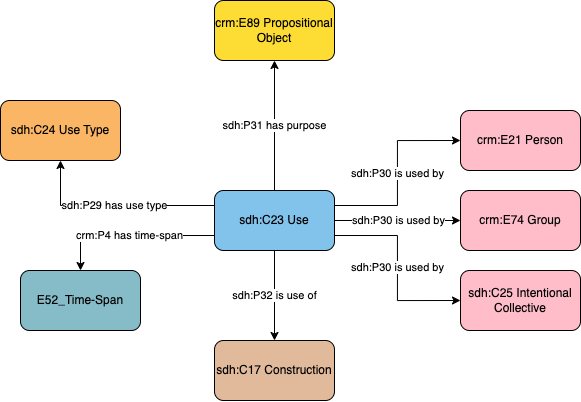

# Construction - Use

## Questions to answer

- Not sure what the type of use is

## Description

This profile describes the actual use of a construction for some specific purpose during a specific time-span by a specific person, group or general intentional collective (in other words informal groups). This implies that a use is specific to that entity that uses it, and another entity should be connected to another use event.
This profile is in opposition to the intended use of a construction.

## What can be described in this profile

- The use of the construction
- The type of usage, documented witrh a controlled vocabulary
- The person, group or intentional collective that used that construction
- The time-span of that usage

## Diagram

## Examples

### Example 1

Fictional: A building that was built as a temple, has been used as a temple from its construction in 123 AD until 450 AD, where it was used as a granary until it's destruction in 750.

### Example 2

Do we need another example?
