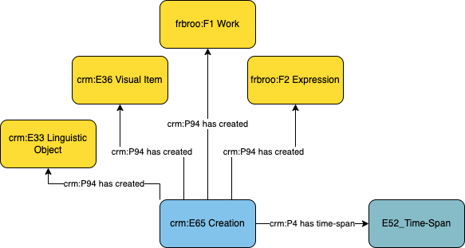

# Information Object - Creation

## Questions to answer

- Do we need a separate profile for each class of information object? I would say so.
- How to better describe this profile?
- Do we need more sub classes of E89 Propositional Object that could be created?

## Description

This profile describes the event creation of information objects and connects it to information objects.

## What can be described in this profile

No information is documented in this profile. It only link the creation event with a specific information object.

## Diagram

## Examples

### Example 1

Fictional: The creation of a poem.
