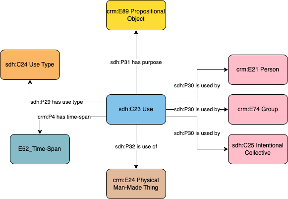

# Object - Use

## Questions to answer

- Do we need the intentional collective to specify the use for one culture in opposition to the use by another culture?
- Not sure what the type of use is
- Do we need a Use Type directly linked to the object with `crm:P101 had as general use (was use of)`?

## Description

This profile describes the actual use of an object for some specific purpose during a specific time-span by a specific person, group or general intentional collective (in other words informal groups). This implies that a use is specific to that entity that uses it, and another entity should be connected to another use event.
This profile is in opposition to the intended use of an object.

## What can be described in this profile

- The use of the object
- The type of usage, documented with a controlled vocabulary
- The person, group or intentional collective that used that object
- The time-span of that usage

## Diagram

## Examples

### Example 1

Fictional: A pot has beeen used as a cooking pot (as traces of fire attests it), but have been used as a funerary urn from 250 AD onwards.

### Example 2

Fictional: A cooking knife has been used as a cooking knife, but also as a carving tool by a specific sculptor.
