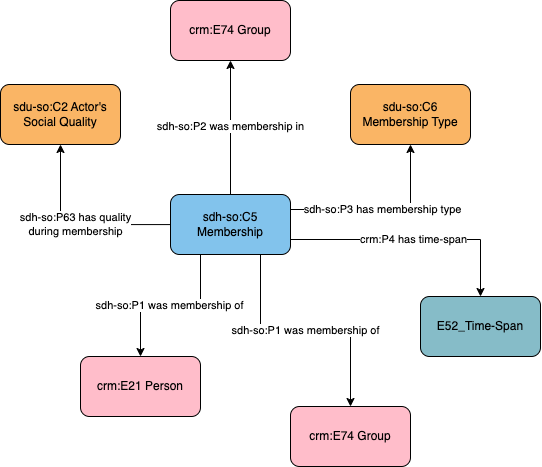

# Person and Group - Membership

## Questions to answer

## Description

This profile describes the fact that a person or a group is a member of a group over a specific time-span, as well as the type of their membership and their social role within this group.

This profile does not describe the events of Joining or Leaving a group. If those events should be documented further, the profile `Person and Group - Joining and Leaving` should be used.

## What can be described in this profile

- The group that the person or group joined
- The type of membership, documented with a controlled vocabulary
- The role of the person or group within the joined group, documented with a controlled vocabulary
- The time-span of that membership

## Diagram

## Examples

### Example 1

Louis Paster (1822 - 1895) become a member of the Académie de médecine in 1873, as a "membre associé libre" (role or type of membership?) until his death in 1895.
Louis Paster (1822 - 1895) became a member of the Académie Française in 1881, until his death in 1895 (no role and type of membership)

### Example 2

Fictional: Group, with role:, type of membership:, time-span:
