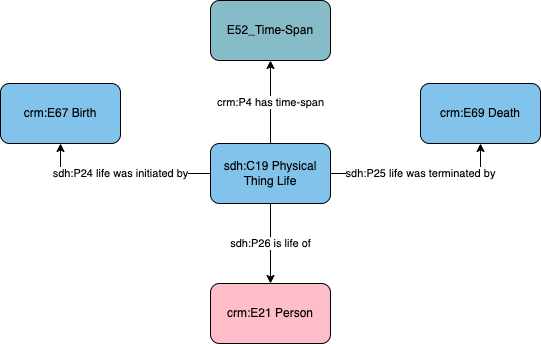

# Person - Life

## Questions to answer

- In the scope note of `sdh:C19 Physical Thing Life`, it is mentionned that it can be used for the floruit, but that seems a different concept.
- Should the label be "known life"?

## Description

This profile describes the collection of events that make up the existence and life of a person.

## What can be described in this profile

- The

## Diagram

## Examples

### Example 1

Louis paster (1822 - 1895) has his life started in 1822 and ended in 1895.

### Example 2

The Roman consul Vettius Cornificius Gordianus is attested to be alive in the year 275.
