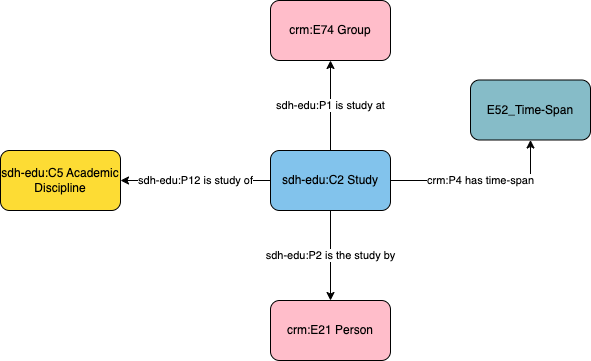

# Person - Study

## Questions to answer

- The localisation of the Study Title:
  - Either it's also on Study
  - Or it is linked to the Group (University/School)

## Description

This profile describes the studies undertaken by an individual, including the academic discipline of those studies and the institution in which those studies have been followed.

## What can be described in this profile

- The discipline in which the study was followed
- The time-span of the study
- The group (school, university, etc.) in which the study was taken

## Diagram

## Examples

### Example 1

Louis paster (1822 - 1895), studied Physics and Chemestry between 1844 and 1847 at the École Normale Supérieure in Paris (France).

### Example 2

An other example needed?
