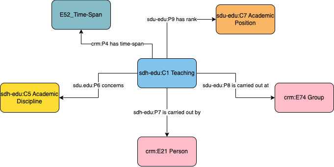

# Person - Teaching

## Questions to answer

- Change the name `sdh-edu:C7 Academic Position` into something less confusion with the `sdh-so:C13 Social Role Embodiment`. Maybe with “Academic Rank”?
- There is an issue for me with the Academic Position, that describes the person, and not the teaching activity. You can teach the same course, as a assistant ptofessor or as a professor.
- Do we need to add the place, or is it documented with the group?

## Description

This profile describes the Teaching activities, different from the Academic Position, that an individual can give within an institution and during a certain time-span. Different teaching times of different subjects should be recorded creating different instances of this class. The discipline in which this teaching is given is also documented in this profile, as well as the Academic Position (/rename as Academic Ranking?), that is the rank of a scientist or teacher in a college, high school, university, or research establishment. It indicates the relative importance and power of individuals in academia and is generally associated with rights and duties defined by the university statutes or the law of a country.

## What can be described in this profile

- The Discipline in which the teaching is given
- The Group (teaching instituion) in which this teaching is given
- The academic ranking associated with the teaching activity
- The time-span of that teaching

## Diagram

## Examples

### Example 1

Louis Paster (1822-1895) was briefly a professor of physics at the Dijon Lycée in 1848.

### Example 2

An other example needed?
